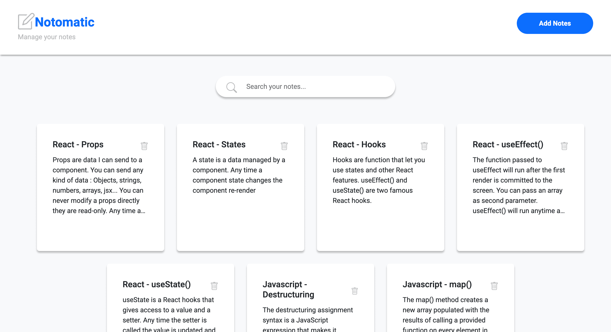

# Notomatic



Notomatic est une application de prises de notes sous forme de post-it. Vous avez la possibilité d'ajouter, modifier ou supprimer une note.

## Configuration :

- React
- Redux
- JSON server pour le back-end

## Installation

```bash
npm i
npm run dev-server
npm start
```
